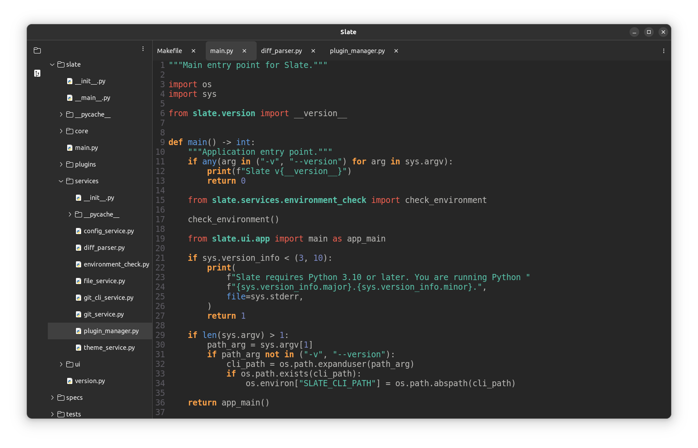

**Slate** is a lightweight, fast-loading code editor for Ubuntu/Linux desktops. It is built with Python3 and GTK4, leveraging Python's deep Linux system integration for native performance. This is an experimental project at early stage.

