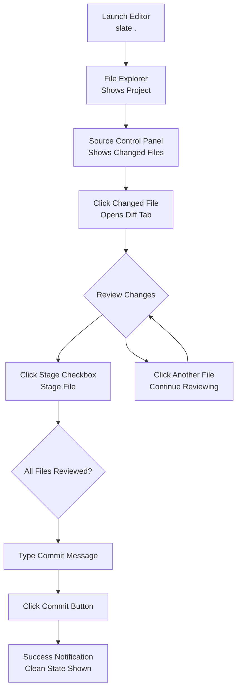
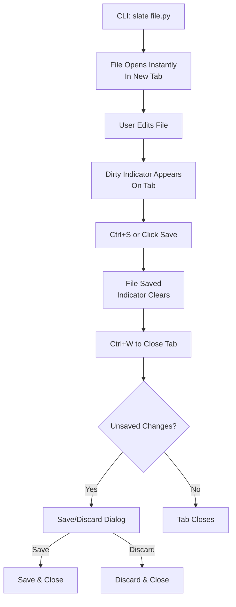
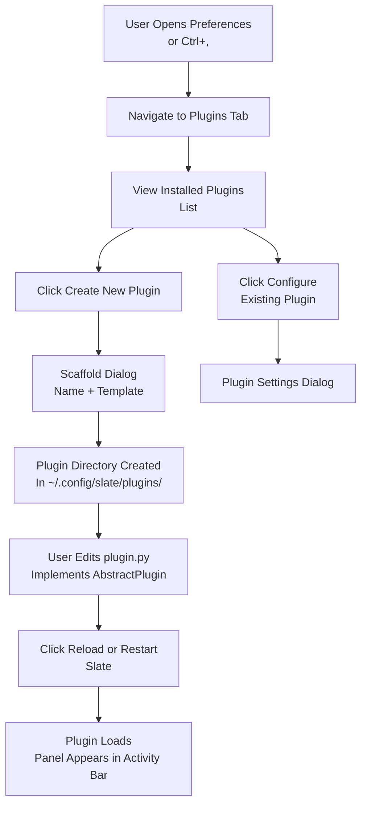

# UX Design Specification Slate

**Author:** Raziur
**Date:** 2026-03-24

---

<!-- UX design content will be appended sequentially through collaborative workflow steps -->

## Executive Summary

### Project Vision

Slate is a lightweight, native Linux code editor built for AI-assisted code review workflows. It combines VSCode-like UX patterns (activity bar, file explorer, search, source control) with sub-2-second cold start performance, using Python + GTK4 and native Linux tools. The plugin-first architecture means core features ARE plugins built on a public API.

### Target Users

**Primary**: AI-augmented developers on Ubuntu/Linux who spend more time reviewing AI-generated code than writing it. They value instant startup, native Linux feel, and complete review workflow (open → diff → stage → commit) without touching the terminal.

**Secondary**: Linux-first developers seeking fast, lightweight VSCode-like alternatives without Electron overhead.

### Key Design Challenges

1. **Performance vs. UX trade-off**: Achieving sub-2-second launch while delivering VSCode-like feature richness. Every interaction needs to feel instant — no loading spinners, no "Setting up..."
2. **Familiarity without clutter**: Users expect VSCode-like panels and keybindings, but the UI must feel native and lightweight — not like a feature-dense Electron app
3. **Plugin discovery**: Since core features ARE plugins, users need an intuitive way to discover and interact with panels without feeling like they're using a "plugin platform"

### Design Opportunities

1. **"Invisible" editor**: The UX should make the editor disappear so users focus entirely on code — no visual noise, no friction
2. **Diff-centric workflow**: First-class inline diff viewing with stage/unstage checkboxes — optimized for reviewing AI-generated changes
3. **Progressive disclosure**: Start simple, let users discover advanced features (like plugin extensibility) organically

## Core User Experience

### Defining Experience

Slate's core experience centers on the code review cycle: open file → navigate to diff → review → stage → commit — all without touching the terminal. This is the primary value prop: enabling developers to complete full review sessions entirely within the editor. The sub-2-second launch is foundational — it's not a feature, it's the entry point that makes everything else possible.

### Platform Strategy

- **Platform**: Desktop app (Linux/Ubuntu 22.04+)
- **Input**: Mouse + keyboard (VSCode-like shortcuts)
- **Framework**: Python + GTK4
- **Offline**: Fully offline capable, no network required

### Effortless Interactions

- Instant launch (<2s cold start)
- Zero-lag file navigation and search
- Zero-config theme inheritance (GTK4 auto-detect via Gtk.Settings)
- Tab management with dirty indicators and save guards
- Complete git workflow (status → diff → stage → commit) in-panel

### Critical Success Moments

1. **First launch**: "this is exactly what I needed" — no setup, just works
2. **Review completion**: The moment you realize you never touched the terminal
3. **Quick edits**: Sub-15-second interruptions that don't break flow

### Experience Principles

1. **Invisible by default** — editor disappears, users focus on code
2. **Performance is UX** — speed is foundational, not a nice-to-have
3. **Familiar first** — VSCode patterns, native Linux feel
4. **Review-optimized** — every interaction serves the code review workflow

## Desired Emotional Response

### Primary Emotional Goals

**Calm productivity** is the core emotional target. The editor should feel like a quiet partner, not a demanding tool. Users should feel "in flow" — focused, efficient, never fighting the interface. The sub-2-second launch and zero-lag interactions create a sense that the tool disappears entirely.

Secondary emotional targets:
- **Confident**: Every interaction works predictably (VSCode patterns, native feel)
- **Accomplished**: Complete entire review cycles without friction or context switches  
- **Empowered**: The plugin system gives users ownership over their tool

### Emotional Journey Mapping

- **First launch**: "This just works" — pleasant surprise, relief vs. VSCode's "Setting up..."
- **During core use**: Calm focus — editor disappears, attention on code
- **After completing review**: Accomplishment — "I got through this without touching the terminal"
- **Returning to use**: Trust and reliability — "Slate is my go-to, it never lets me down"

### Micro-Emotions to Address

- **Confidence vs. Confusion**: Clear file states, git status, tab indicators — never ambiguous
- **Accomplishment vs. Frustration**: Complete workflows in-panel, no dead ends
- **Calm vs. Anxiety**: Save/discard guards on close, clear dirty indicators, auto-save option
- **Empowered vs. Constrained**: Plugin API is accessible, not hidden

### Emotional Design Principles

1. **Speed creates calm** — every interaction under 100ms feels natural
2. **Familiarity builds confidence** — VSCode patterns reduce learning curve
3. **Completeness enables accomplishment** — full git workflow in-panel
4. **Extensibility creates ownership** — plugins make it "your" editor

## UX Pattern Analysis & Inspiration

### Inspiring Products Analysis

1. **VSCode** — The UX benchmark for code editors. Adoption targets:
   - Activity bar with panel icons (Explorer, Search, Source Control, Preferences)
   - File explorer tree with lazy loading
   - Search panel with case/whole-word/regex options and replace
   - Source control panel with inline diffs and stage/unstage checkboxes
   - Tab management with dirty indicators and save/discard guards
   - VSCode-style keyboard shortcuts for familiarity

2. **Zed** — Performance inspiration:
   - Native feel without Electron overhead
   - Sub-2-second startup as baseline expectation
   - Minimal UI chrome, focus on code

3. **GTK4** — Platform-native design:
   - System theme inheritance via Gtk.Settings (light/dark auto-switch)
   - Native GTK4 widgets
   - GNOME desktop consistency

### Transferable UX Patterns

- **Navigation**: Activity bar for panel switching, Ctrl+Tab for tab cycling
- **File Explorer**: Tree view with expand/collapse, context menus
- **Search**: Global search panel (Ctrl+Shift+F), find & replace
- **Source Control**: Status badges, inline diffs, stage/unstage checkboxes, commit bar
- **Tabs**: Dirty indicators, reorderable, save/discard guards on close

### Anti-Patterns to Avoid

- **Electron bloat**: VSCode suffers from startup lag — don't repeat this
- **Polling file changes**: Use GIO FileMonitor for native inotify
- **Terminal dependency**: Complete git workflow in-panel
- **Feature overload**: Ship MVP core, expand through plugins

### Design Inspiration Strategy

**What to Adopt:**
- VSCode UX patterns (panels, shortcuts, layout)
- GTK4 for native Linux feel

**What to Adapt:**
- VSCode complexity → simplify for lightweight feel
- Activity bar → minimal icons, focused panels only

**What to Avoid:**
- Electron-based approaches
- Pure-Python fallbacks (use native Linux tools)
- Over-configured theme setup — auto-detect is key

## Design System Foundation

### Design System Choice

**GTK4** — The native Linux platform design system. Slate uses GTK4 for all UI components.

### Rationale for Selection

- **Native integration**: GTK4 is the standard Linux desktop UI framework
- **System theme inheritance**: GTK4 automatically matches system light/dark preference via Gtk.Settings
- **Zero setup**: No custom theme configuration required — works out of the box
- **Performance**: Native widgets have minimal overhead vs. custom UI layers
- **Familiarity**: Ubuntu/GNOME users already know this visual language
- **Consistency**: Matches other GNOME apps (Files, Terminal, etc.)

### Implementation Approach

- Use GTK4 `ApplicationWindow`, `HeaderBar`, `Sidebar` for main layout
- GtkSourceView 5 for editor component with custom syntax highlighting
- GTK4 CSS classes for standard widgets
- Custom CSS overlay for editor-specific theming
- GAction-based menu system following GNOME conventions

### Customization Strategy

- **Editor theming**: Custom GtkSourceView style schemes (monokai, solarized, etc.)
- **Panel styling**: Minimal custom CSS to match VSCode-like layout
- **Activity bar icons**: XDG symbolic icons
- **Syntax highlighting**: Predefined color schemes via GtkSourceView

## 2. Core User Experience

### 2.1 Defining Experience

**"Complete Code Review Without Touching the Terminal"** — The core interaction that defines Slate: open editor → navigate to changed files → review diffs → stage/unstage → write commit → commit — all within the editor. This is the "one thing" that makes Slate special.

### 2.2 User Mental Model

Users come from two backgrounds:
- **VSCode users**: Expect panels, shortcuts, familiar workflows — frustrated by slow startup
- **Terminal users**: Comfortable with `git` CLI but want to reduce context switching

**Expectations:**
- Instant availability (<2s to interactive)
- VSCode-like panel layout and behavior
- Complete git workflow in-panel (status → diff → stage → commit)
- No terminal needed for daily review work

### 2.3 Success Criteria

- **"This just works"**: Editor opens in <2s, immediately usable
- **Zero terminal touches**: Complete review cycle without git CLI
- **Familiar muscle memory**: VSCode shortcuts work, panels behave expectedly
- **Instant feedback**: <100ms response on every interaction, no loading states

### 2.4 Novel UX Patterns

Uses **established patterns** (VSCode-inspired) rather than novel interactions:
- Activity bar + panel layout
- File explorer tree with context menus
- Source control with inline diffs and stage checkboxes

**The differentiator is not the pattern — it's the performance + native Linux feel.**

### 2.5 Experience Mechanics

**1. Initiation:**
- CLI: `slate .` (folder) or `slate file.py` (single file)
- Window opens instantly with folder loaded in File Explorer

**2. Interaction:**
- Click file in explorer → opens in tab
- Click Source Control panel → shows changed files with status badges
- Click file → shows inline diff
- Checkbox to stage/unstage
- Type commit message → click Commit

**3. Feedback:**
- Tab dirty indicator (dot) shows unsaved changes
- Stage checkbox shows staged state immediately
- Commit button enables only when staged + message entered

**4. Completion:**
- Commit success notification
- Panel updates to show clean state
- Ready for next review task

## Visual Design Foundation

### Color System

**Platform-Inherited (GTK4/Adwaita):**
- Light/dark mode: Auto-detected from GNOME settings
- UI chrome colors: Adwaita semantic colors (background, surface, accent)
- Editor syntax highlighting: Customizable via GtkSourceView style schemes
  - Default: system-appropriate (light or dark based on theme)
  - Options: monokai, solarized-light, solarized-dark, dracula, etc.
- Accent color: Follows system accent preference

### Typography System

- **UI Font**: System default (Cantarell on GNOME) — inherits from Adwaita
- **Editor Font**: Monospace (default: system monospace, user-configurable via Preferences)
- **Type Scale**: GTK4 defaults for UI consistency
- **Rationale**: Native apps should feel native — users can customize editor font

### Spacing & Layout Foundation

- **Base Unit**: 6px (GTK4 grid)
- **Density**: Standard GTK4 spacing — balanced, not cramped
- **Layout**: VSCode-inspired but native:
  - Activity bar (left): 48px wide, panel icons
  - Side panel: Resizable, min 200px, max 50% window
  - Editor area: Flexible, fills remaining space
  - Tab bar: Above editor, 35px height

### Accessibility Considerations

- GNOME accessibility guidelines (built into GTK4)
- System high contrast mode support
- Full keyboard navigation via GTK4
- Screen reader compatible out of the box

## User Journey Flows

### Journey 1: Daily Review Workflow

The primary user journey — complete code review without touching the terminal.



**Entry Point:** CLI invocation (`slate .`)

**Key Interactions:**
1. **Launch → Explorer**: Instant folder load in file tree
2. **Explorer → Source Control**: Click icon or use Ctrl+Shift+G
3. **Source Control → Diff**: Click file to open inline diff
4. **Review → Stage**: Single checkbox click
5. **All Staged → Commit**: Message + button

**Success Indicators:**
- Files show staged/unstaged state via checkbox
- Commit button enables only when staged files exist AND message entered
- Success toast notification on commit

**Error Recovery:**
- If git not installed: Source Control shows "git not found" with install instructions
- If commit fails: Error message in commit bar, no state change
- If file deleted externally: Refresh icon updates tree

---

### Journey 2: Quick Edit

Single file quick edit scenario — open, edit, save, close.



**Entry Point:** CLI invocation (`slate /path/to/file`)

**Key Interactions:**
1. **Launch → Edit**: File opens instantly with syntax highlighting
2. **Edit → Save**: Ctrl+S with instant feedback
3. **Close Tab**: Ctrl+W triggers save guard if dirty

**Success Indicators:**
- Tab shows filename, dirty indicator (dot) when modified
- Save confirmation via indicator clearing
- Clean close with no data loss

**Error Recovery:**
- Save fails: Error toast with reason, file remains open
- External deletion: Warning on save attempt
- Permission error: Clear error message

---

### Journey 3: Plugin Extension

Creating custom plugins using the public API.



**Entry Point:** Preferences → Plugins panel

**Key Interactions:**
1. **Preferences → Plugins**: List of installed plugins
2. **Create → Scaffold**: New plugin from template
3. **Implement → Reload**: Developer workflow for plugin creation
4. **Configure**: Per-plugin settings dialog

**Success Indicators:**
- New panel icon appears in activity bar
- Plugin shows in installed plugins list
- No core instability during development

**Error Recovery:**
- Plugin crashes: Caught, disabled, error logged
- Syntax error in plugin: Clear error message, disable plugin
- API misuse: Documentation link in error message

---

### Journey Patterns

Across these flows, common patterns emerge:

**Navigation Patterns:**
- **Activity Bar**: Primary navigation hub — all panels accessible from icons
- **Keyboard First**: Ctrl+Shift+G (Source Control), Ctrl+Shift+F (Search), Ctrl+, (Preferences)
- **Panel Context**: Each panel has clear focus state and back navigation

**Decision Patterns:**
- **Stage/Commit**: Binary choice with checkbox → enabled state
- **Save/Discard**: Guard dialog prevents accidental data loss
- **Enable/Disable**: Plugin state with immediate feedback

**Feedback Patterns:**
- **Instant**: No loading spinners — operations complete in <100ms
- **Toast Notifications**: Commit success, save confirmation, errors
- **Visual State**: Checkboxes, dirty dots, enable/disable toggles

---

### Flow Optimization Principles

1. **Minimize steps to value**: Daily review = 3 minutes (launch → review → commit)
2. **Reduce cognitive load**: One action per panel — stage here, commit here
3. **Clear progress**: Badges show file counts, checkboxes show staged state
4. **Error handling**: Graceful degradation with actionable messages
5. **Keyboard efficiency**: VSCode shortcuts for power users

**Optimization Targets:**
- Sub-2-second launch → first interaction within 2s
- Tab switching <50ms → instant context switch
- Save <100ms → no perceptible delay
- Diff render <100ms → review without waiting

## Component Strategy

### Design System Components

**Available from GTK4:**

| Component | Usage |
|-----------|-------|
| `GtkApplicationWindow` | Main window container |
| `GtkHeaderBar` | Title bar with window controls |
| `GtkSidebar` | Side panel container |
| `GtkStack` | Panel switching |
| `GtkTreeView` | File explorer, file lists |
| `GtkListBox` | Search results, plugin lists |
| `GtkTextView` | Commit message input |
| `GtkButton` | Action buttons |
| `GtkCheckButton` | Stage/unstage checkboxes |
| `GtkEntry` | Search input, text fields |
| `GtkPopover` | Context menus, dropdowns |
| `GtkSwitch` | Toggle settings |
| `GtkScrolledWindow` | Scrollable content |
| `GtkNotebook` | Tab bar container (base) |
| `GtkDialog` | Save/discard confirmation |
| `GtkMessageDialog` | Error/info dialogs |
| `GtkToast` | GNOME 42+ notifications |

### Custom Components

#### 1. Activity Bar

**Purpose:** Primary navigation for switching between panels (Explorer, Search, Source Control, Preferences)

**Anatomy:**
- 48px wide vertical bar on left edge
- Icon buttons (32x32) with tooltips
- Active indicator (highlighted background)
- Bottom: settings icon

**States:**
- Default: XDG icon (symbolic), 60% opacity
- Hover: 80% opacity
- Active: Full opacity + highlight background

**Accessibility:**
- Tab navigation between icons
- Arrow keys for vertical navigation
- Enter/Space to activate
- aria-label on each icon

---

#### 2. Tab Bar

**Purpose:** Manage open file tabs with dirty indicators

**Anatomy:**
- 35px height horizontal bar
- Each tab: filename + dirty indicator (●) + close button (×)
- Active tab: highlighted background
- Draggable for reordering

**States:**
- Default: normal background
- Hover: lighter background, show close button
- Active: highlighted background
- Dirty: ● indicator visible
- Modified (unsaved): bold filename

**Accessibility:**
- Tab key cycles through tabs
- Ctrl+Tab / Ctrl+Shift+Tab for next/previous
- Keyboard shortcut display on hover (tooltip)

---

#### 3. File Explorer Tree

**Purpose:** Browse project folder structure with lazy loading

**Anatomy:**
- Tree view with folder/file icons
- Expand/collapse arrows
- Indentation: 16px per level
- Context menu on right-click

**States:**
- Default: folder/file icon
- Selected: highlighted background
- Expanded: folder-open icon
- Collapsed: folder icon

**Content:**
- Filter input at top
- Breadcrumb path
- File count badge on folders

---

#### 4. Diff View

**Purpose:** Inline diff display for reviewing changes

**Anatomy:**
- Split or unified view toggle
- Line numbers (old/new)
- Addition highlighting (green background)
- Deletion highlighting (red background)
- Stage/unstage checkbox per file

**States:**
- Default: showing diff
- Loading: skeleton placeholder (<100ms max)
- Empty: "No changes" message
- Error: error message with retry

**Variants:**
- Unified (default): single pane with +/- markers
- Split: side-by-side view

---

#### 5. Source Control Panel

**Purpose:** Git status, diff viewing, stage/unstage, commit

**Anatomy:**
- Header: branch name + sync icon
- Changed files list with status badges (M, A, D)
- Inline diff when file selected
- Stage checkboxes
- Commit bar: message input + Commit button

**States:**
- Clean: "All changes committed"
- Dirty: file count badge
- Staged: staged count badge
- Syncing: spinner on sync icon

**States per file:**
- Modified (M): yellow badge
- Added (A): green badge
- Deleted (D): red badge
- Renamed (R): blue badge

---

#### 6. Search Panel

**Purpose:** Project-wide search with ripgrep

**Anatomy:**
- Search input with options (case, regex, whole-word)
- Replace input (toggle with Ctrl+H)
- Results list with file:line:content
- Replace action buttons

**States:**
- Default: search input focused
- Searching: input + spinner
- Results: file matches grouped
- No results: "No matches found"
- Error: "ripgrep not found" with install link

---

#### 7. Commit Bar

**Purpose:** Commit staged changes with message

**Anatomy:**
- TextView for commit message (multi-line)
- Character count
- Commit button (right side)
- Cancel link (left side)

**States:**
- Disabled: no staged files OR empty message
- Enabled: staged files + message entered
- Loading: button shows spinner
- Error: error message, remains enabled

**Validation:**
- Min 1 character in message
- At least 1 staged file

---

#### 8. Save/Discard Dialog

**Purpose:** Guard against accidental data loss

**Anatomy:**
- Dialog title: "Save changes?"
- File name displayed
- Three buttons: Save, Don't Save, Cancel

**States:**
- Default: Save highlighted (safe default)
- Warning: "Don't Save" in red if significant data

**Accessibility:**
- Enter = Save (default)
- Escape = Cancel
- Focus trap in dialog

---

### Component Implementation Strategy

**Foundation Components (GTK4/Adwaita):**
- All buttons, inputs, dialogs
- Window chrome, panels
- Scroll containers
- Popovers, menus

**Custom Components:**
- Activity Bar: Custom widget wrapping icon buttons
- Tab Bar: Custom widget extending GtkNotebook
- File Explorer: Styled GtkTreeView with custom model
- Diff View: Custom widget with GtkSourceView diff rendering
- Source Control Panel: Composite widget
- Search Panel: Composite with ripgrep integration
- Commit Bar: Custom composite widget
- Toast Notifications: GNOME 42+ GtkToast, fallback to custom

### Implementation Roadmap

**Phase 1 - Core Components (MVP):**

| Component | Priority | Critical For |
|-----------|----------|---------------|
| Activity Bar | P0 | All panel navigation |
| Tab Bar | P0 | File editing |
| File Explorer | P0 | Daily Review journey |
| Source Control Panel | P0 | Daily Review journey |
| Save/Discard Dialog | P0 | Quick Edit journey |

**Phase 2 - Supporting Components:**

| Component | Priority | Enhances |
|-----------|----------|----------|
| Search Panel | P1 | Navigation workflow |
| Commit Bar | P1 | Daily Review journey |
| Diff View | P1 | Review experience |

**Phase 3 - Enhancement Components:**

| Component | Priority | Adds |
|-----------|----------|------|
| Toast Notifications | P2 | Feedback clarity |
| Plugin Config Dialogs | P2 | Extensibility |
| Preferences Panel | P2 | Customization |

## UX Consistency Patterns

### Button Hierarchy

**Primary Actions:**
- **Commit Button**: Solid accent color background, prominent
  - Only enabled when staged files + message present
  - Shows spinner during commit operation
  
- **Save Button**: Solid accent color
  - Ctrl+S shortcut displayed in tooltip
  
**Secondary Actions:**
- **Refresh**: Icon button (circular arrows)
  - For Source Control, File Explorer sync
- **Cancel**: Text button, right-aligned in dialogs

**Tertiary Actions:**
- **Context menu items**: File operations (rename, delete, new file)
- **Panel toggles**: View options, filters

**Pattern Rules:**
- Primary: max 1 per panel section
- Keyboard shortcuts: tooltips show shortcuts
- Disabled state: 50% opacity, no pointer events

---

### Feedback Patterns

**Success (Toast):**
- **Commit**: "Changes committed" with branch name
- **Save**: "File saved" (auto-dismiss after 2s)
- **Plugin enabled**: "Plugin activated"

**Error (Toast + Inline):**
- **Commit failed**: Error message in commit bar + toast
- **Save failed**: Toast with reason, file remains dirty
- **Git not found**: Full panel message with install instructions
- **ripgrep not found**: Search panel message with install link

**Warning (Dialog):**
- **Unsaved changes**: Save/Discard dialog on close
- **Overwrite dirty**: "File modified externally" with Save/Reload/Ignore

**Info (Toast):**
- **Branch switched**: "Switched to [branch]"
- **File staged/unstaged**: Brief toast, checkbox reflects state

**State Indicators:**
- Dirty tab: ● (centered dot) after filename
- Stage checkbox: unchecked/checked states
- Loading: Spinner (no skeleton — aim for <100ms)
- Empty: Helpful message with action hint

---

### Form Patterns

**Search Input:**
- Placeholder: "Search (Ctrl+Shift+F)"
- Clear button (×) when text present
- Options dropdown: Case, Regex, Whole Word
- Enter triggers search
- Escape clears

**Commit Message:**
- Multi-line TextView (min 3 lines visible)
- Character count in corner
- Ctrl+Enter to submit
- Placeholder: "Commit message"

**Preferences:**
- Grouped settings with section headers
- Toggle switches for boolean settings
- Dropdown for enumerated options
- Live preview where applicable

**Validation:**
- Inline validation on blur
- Error state: red border + message below
- Disabled submit until valid

---

### Navigation Patterns

**Activity Bar:**
- Fixed position, 48px width
- Icons: Explorer, Search, Source Control, Extensions
- Keyboard: numbers 1-4 select panel
- Current panel: highlighted background

**Tab Navigation:**
- Ctrl+Tab: Next tab (cycle)
- Ctrl+Shift+Tab: Previous tab
- Ctrl+W: Close current tab
- Ctrl+T: New tab
- Drag: Reorder tabs

**Panel Focus:**
- Escape: Defocus panel, return to editor
- F6: Cycle panels forward
- Ctrl+B: Toggle side panel

**Breadcrumb:**
- File Explorer: Current folder path
- Click any segment to navigate up

---

### Modal & Overlay Patterns

**Dialogs (GtkDialog):**
- Centered on parent window
- Title bar with close button
- Focus trap inside dialog
- Escape closes (with save guard if applicable)

**Context Menus (GtkPopover):**
- Appears at cursor position
- Click outside dismisses
- Keyboard: arrow navigation, Enter selects

**Toast Notifications:**
- Position: Bottom of window, above status bar
- Duration: 3s default, 5s for errors
- Action button: Optional "Undo" or "View"

**Overlays:**
- Diff view: Full panel or inline
- Preferences: Full panel or modal dialog
- Plugin config: Modal dialog

---

### Empty States

**File Explorer Empty Folder:**
- Icon: Empty folder
- Message: "This folder is empty"
- Action: "Create File" / "Create Folder" buttons

**Source Control Clean:**
- Icon: Checkmark
- Message: "All changes committed"
- Action: None needed

**Search No Results:**
- Icon: Magnifying glass
- Message: "No matches found for '[query]'"
- Action: "Modify search" link

**No Files Open:**
- Tab area shows: "Open a file to start editing"
- Welcome: Recent files list below

**Pattern Rules:**
- Always include icon + message + action (if applicable)
- Match system theme (Adwaita)

---

### Loading States

**Instant (<100ms):**
- No loading indicator — operation completes instantly
- Target for all core interactions

**Fast (100-500ms):**
- Skeleton placeholders for list content
- Spinner in button for commit, save

**Slow (>500ms):**
- Progress indicator for ripgrep search
- Cancel button for long operations

**Pattern Rules:**
- Never show full-screen loaders — use inline indicators
- Always show result even if slow (progress updates)
- Cancel option for operations >2s

---

### Keyboard Shortcut Patterns

**Shortcut Display:**
- Tooltip: Show shortcut on hover
- Menu: Full shortcut in menu item

**Shortcut Conflicts:**
- VSCode-compatible: Familiar muscle memory
- Override warning: If plugin registers conflicting shortcut

**Focus Management:**
- Ctrl+P: Quick file open
- Ctrl+Shift+P: Command palette (future)
- Escape: Cancel / Defocus / Close

**Pattern Rules:**
- All actions accessible via keyboard
- Shortcuts visible in tooltips
- No shortcut-only actions (always menu/button alternative)

## Responsive Design & Accessibility

### Responsive Strategy

Slate is a **desktop-only application** targeting Ubuntu/Linux 22.04+. Responsive design focuses on window resizing rather than device adaptation.

**Window Size Strategy:**

| Window State | Width | Behavior |
|--------------|-------|----------|
| Minimum | 800x600 | All features accessible |
| Default | 1200x800 | Balanced layout |
| Maximized | Full screen | Full screen utilization |

**Panel Resizing:**
- Side panel: Resizable via drag handle
- Min width: 200px
- Max width: 50% of window
- Collapse: Ctrl+B toggles visibility

**Content Density:**
- Single density: Optimized for desktop interaction
- No responsive breakpoints: Desktop-focused UX
- Scroll: Natural scrolling within panels

**Multi-Monitor:**
- Remembers window position per monitor
- DPI-aware scaling via GTK4

---

### Accessibility Strategy

**Compliance Target:** WCAG 2.1 Level AA

As a developer tool, accessibility is essential for:
- Developers with visual impairments
- Motor accessibility needs
- Screen reader users

**GTK4 Built-in Accessibility:**
- GNOME accessibility stack integration
- ATK (Accessibility Toolkit) support
- Orca screen reader compatibility
- High contrast mode support

**Color Accessibility:**
- Diff colors: Must maintain 4.5:1 contrast
- Status badges: Use icons + colors (not color alone)
- Syntax highlighting: High contrast schemes available

**Keyboard Navigation:**
- All actions accessible via keyboard
- Tab order: Logical left-to-right, top-to-bottom
- Focus visible: Clear focus indicator on all focusable elements
- Shortcuts: All shortcuts documented in tooltips

**Screen Reader Support:**
- GTK4 widgets: Built-in ARIA equivalents via ATK
- Custom widgets: Implement AtkAccessible interface
- Announcements: For dynamic content changes

---

### Testing Strategy

**Accessibility Testing:**

| Test | Tool/Method | Frequency |
|------|-------------|-----------|
| Keyboard navigation | Manual tab-through | Every release |
| Screen reader | Orca on GNOME | Every release |
| High contrast | System settings toggle | Weekly |
| Color blindness | Simulation tools | Design review |
| Focus indicators | Visual inspection | Every release |

**Manual Testing Checklist:**
- [ ] Tab through all interactive elements
- [ ] Verify focus indicator visible
- [ ] Test with Orca screen reader
- [ ] Toggle high contrast mode
- [ ] Test keyboard shortcuts
- [ ] Verify error messages announced

**Automated Testing:**
- GTK4 accessibility audit (atk-bridge)
- Custom widget accessibility assertions

---

### Implementation Guidelines

**For Developers:**

**Keyboard Navigation:**
```
1. Use GTK4 widgets (they handle most a11y)
2. Set tab order explicitly if needed: GtkWidget::tab-focus
3. Add keyboard shortcuts for all actions
4. Test with keyboard only (no mouse)
```

**Screen Reader:**
```
1. Use semantic GTK4 widgets (not custom drawing)
2. Set accessible names: GtkAccessible::accessible-name
3. Set accessible descriptions: GtkAccessible::accessible-description
4. Announce dynamic changes: GtkWidget::notify::accessible-state
```

**Focus Management:**
```
1. Focus follows selection in lists
2. Dialogs trap focus (GtkDialog handles this)
3. Escape returns focus to previous context
4. No focus theft - user controls focus
```

**High Contrast:**
```
1. Use Adwaita colors (already high contrast)
2. Don't override with custom colors in high contrast
3. Test with GNOME High Contrast theme
4. Status must be clear without color alone
```

**Touch Target Sizes:**
```
- Minimum: 44x44px (GNOME HIG)
- Icons: 24x24px minimum
- Buttons: Follow GTK4 defaults
```

---

### GNOME Integration for Accessibility

**System Accessibility Settings:**
- Respect system high contrast mode
- Respect reduced motion setting
- Respect screen reader enabled state

**Implementation:**
```python
# Check system accessibility settings
settings = Gtk.Settings.get_default()
high_contrast = settings.get_property("gtk-application-prefer-dark-theme")

# Respect reduced motion
if settings.get_property("gtk-enable-animations"):
    # Enable animations
else:
    # Reduce/remove animations
```

**Orca Integration:**
- GTK4 widgets work with Orca out of the box
- Custom components need AtkImplementation
- Test with Orca reading all UI elements
